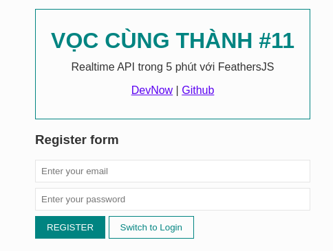

# Vọc cùng Thành #11 - Realtime API trong 5 phút với FeathersJS

## Giới thiệu

**Vọc cùng Thành #11 - Realtime API trong 5 phút với FeathersJS** là một webapp để demo cho [bài viết cùng tên][post]



[**Demo**][demo] | [**DevNow Article**][post]

## Yêu cầu

- [git][git]
- [node][node]

## Cài đặt

```bash
# Clone repo
git clone https://github.com/EGANY-Team/vct-11-feathersjs
cd vct-11-feathersjs

# Install package
npm install

# Development: http://localhost:3030
npm run dev

# Production
npm start
```

## Tài liệu tham khảo

- [DevNow][post]
- [FeathersJS][fjs]

[post]: https://devnow.vn/?p=3162
[fjs]: https://feathersjs.com
[git]: https://git-scm.com
[node]: https://nodejs.org
[demo]: https://vct-11.herokuapp.com/
